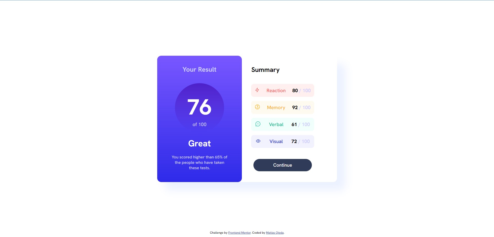
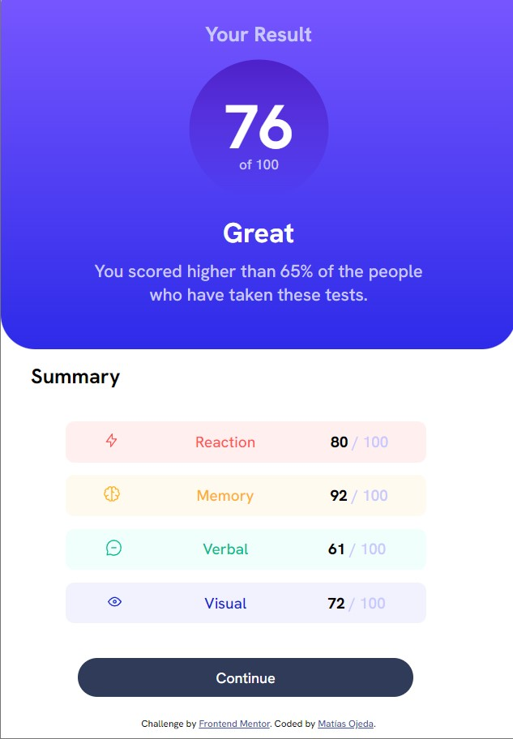

# Frontend Mentor - Results summary component solution

This is a solution to the [Results summary component challenge on Frontend Mentor](https://www.frontendmentor.io/challenges/results-summary-component-CE_K6s0maV). Frontend Mentor challenges help you improve your coding skills by building realistic projects. 

## Table of contents

- [Overview](#overview)
  - [The challenge](#the-challenge)
  - [Screenshot](#screenshot)
  - [Links](#links)
- [My process](#my-process)
  - [Built with](#built-with)
  - [What I learned](#what-i-learned)
  - [Continued development](#continued-development)
  - [Useful resources](#useful-resources)
- [Author](#author)
- [Acknowledgments](#acknowledgments)

## Overview

### The challenge

Users should be able to:

- View the optimal layout for the interface depending on their device's screen size
- See hover and focus states for all interactive elements on the page

### Screenshot

### Links

- Solution URL: [Add solution URL here](https://your-solution-url.com)
- Live Site URL: [Add live site URL here](https://your-live-site-url.com)

## My process

As in my previous challenge, the first step was to write the HTML semantics, followed by the corresponding links to the external stylesheet and google-fonts in the head section of index.html.
Once this was done I continued with the writing of the CSS code, using flexbox to place everything in its respective place.
Through a media query make the design responsive for smaller screens.

### Built with

- Semantic HTML5 markup
- CSS custom properties
- Flexbox

### What I learned

This challenge made me investigate variable fonts in CSS, although I did not use them in this case, I find myself internalizing this topic.
I also investigated the files with the .json ending since it's the first time I've seen them
These files are not included in my solution as I don't know how to use them yet.

### Continued development

I want to continue practicing responsive design as I don't feel completely comfortable with my code in that regard, it took me longer than I expected.
Once I feel more comfortable writing HTML and CSS my next step will be to start learning JavaScript.

### Useful resources

- [Example resource 1](https://https://www.freecodecamp.org/espanol/news/subir-a-github-lo-suficientemente-simple-para-poetas/) - This helped me upload my files to the GitHub repository.

## Author

- Website - [Support Device - Matías](https://sprtdevice.blogspot.com/)
- Frontend Mentor - [@yourusername](https://www.frontendmentor.io/profile/yourusername)
- Twitter - [@sprtdevice](https://www.twitter.com/sprtdevice)

## Acknowledgments

I appreciate the people who left me their comments on the post of the solution to my previous challenge. It helped me a lot.